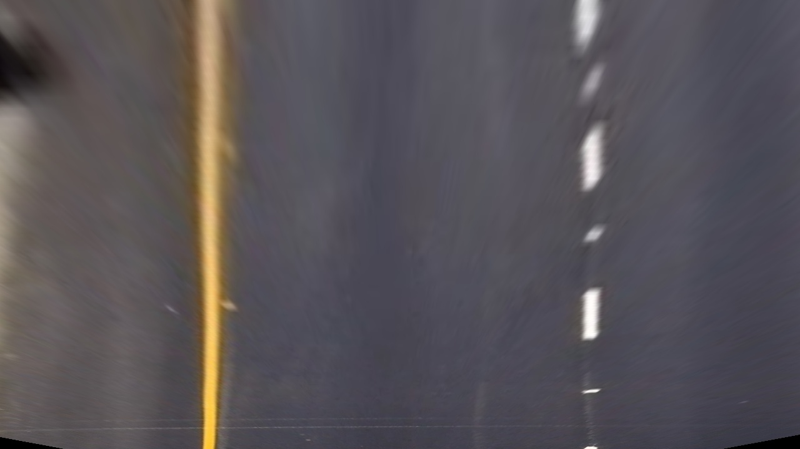

# Advanced Lane Finding Project

## Useful information

Project goals/checkpoints:
- construct a pipeline for processing video frames;
- the pipeline must properly and accurately detect lane markings on the road, 
regardless of shadows and changes in lightning conditions;
- test the pipeline on a set of example images and detect the lane accurately
- detect and calculate lane curvature and lane circle radius
- after testing, proceed and export a video file with the above information overlaid
on top of the video stream.

## Files of interest
- images in the [camera_cal folder](./camera_cal) used in the camera calibration process
- images in the [examples folder](./examples) some used in this writeup, many more available
- [calibration_util.py](./calibration_util.py) - calibration utilities and functions
- [image_manipulation.py](./image_manipulation.py) - image manipulation, gradient and color thresholds
- [line_util.py](./line_util.py) - lane line detection and other stuff, some code is not used yet
- [code.py](./code.py) - this is what is supposed to be run to fully process video
- [filters.ipynb](./filters.ipynb) - started its life as a quick prototyping place in the repo... 
now the whole pipeline is there as well! Feel free to have a look.

---

# Image processing Pipeline

The image processing pipeline used in this project will be assessed here. (Almost) The same 
pipeline used to process a single image is used to process video frames as well.

### Camera calibration
The first step of the proposed pipeline is getting a good camera calibration to rectify 
images with. It is important to note here that each calibration is done 'per camera', or
in other words - a calibration set of images is needed to calibrate a specific camera.

The camera calibration photo set for the specific camera which was used to record the 
dashboard video used for this project are included in the [camera_cal](./camera_cal) 
directory. The set of images was originally provided by Udacity for use in this and other projects.
 The same files can also be found in Udacity's [Advanced Lane Lines project GitHub repository](https://github.com/udacity/CarND-Advanced-Lane-Lines).

The calibration procedure can be seen inside the file [calibration_util.py, lines 53:72](./calibration_util.py). 
The video frames themselves are calibrated in line 277 inside image_manipulation.py.

An example of the image transformation prior to and after calibration can be seen in the 
following pair of images:

Here we can see an example image used for calibration (shown distorted). The image shows 
a 9x6 chessboard pattern which is laid on a flat surface. The image is noticeably 
distorted.

The same image used for calibration, now rectified using the 
resulting camera matrix after the calibration procedure. 
We can clearly see that the image is rectified properly:
all the parallel lines on the chessboard pattern are parallel in the real world 
and vice versa. No bulging is detected, as in the original photo.

Bellow you can see a frame before and after rectification.

When rectified, the image is slightly changed in order for the distortion to be removed. Here, a rectified image:

### Perspective transform
Perspective transform is done prior to the lane finding. I decided to manually specify 
the points to define the image warping transformation. The points were specified on one of
the rectified, straight line example images. The warping functions are defined in lines 
7:39 in the file `image_manipulation.py`. For ease of use, the calculated 
warping and unwarping matrices are defined inline in two functions in the same file.

The source and destination points are given in the table below:

| Point | Source point (px) | Destination point (px) |
|:-----:|:------------:|:-----------------:|
| top, left lane line| 594, 450 | 320, 0 |
| top, right lane line | 687, 450 | 960, 0 |
| bottom, left lane line | 262, 670 | 320, 720 |
| bottom, right lane line| 1044, 670 | 960, 720 |

Lane width: 640 px

The transformations were tested to see if everything is in order, similar to what was discussed 
in the Udacity lectures. Here is an example of a successful image warping (showing before/after):

### Lane line extraction and masking
After successful calibration, the next logical step would be to extract the lane lines
from an image. To do this successfully, I implemented a combined magnitude and directional 
gradient filter, as well as some color filtering. The functions used can be found inside 
[image_manipulation.py, lines 148:263](./image_manipulation.py) and in the [filters jupyter notebook](./filters.ipynb).

An image mask is defined for each frame using the process_frame function defined in 
[image_manipulation.py, starting at line 266](./image_manipulation.py). Here's an example 
of the result after the filtering is done:

An example of lane extraction on an image. Here, the output is shown in RGB, with 
stacked layers representing:
- **R channel**: color filtering (mask)
- **G channel**: ~~HLS's S-layer filtered lines~~ Now dropped in favour of Y,K channels from CMYK
- **B channel**: combined directional and magnitude sobel filter.

After a series of tweaks and tests experimenting with various colour spaces and filtering parameters, I settled on 
replacing the S-channel filter from HLS with one using the Y and K channels in CMYK. The Y layer is used to extract the 
yellow line from the road, as it is very clearly seen and can be easily extracted. The K layer can help detect both 
yellow and white lines - they are presented as deep blacks in the picture given bellow. 

The Y channel in CMYK, here shown in grayscale. The yellow component is obviously high for yellow lane lines.

The K channel in CMYK, here shown in grayscale. Note the deep blacks showing the lane lines.

The image processing pipeline uses a binary image output like this one:

Such masks are a result of lines 194:250 as seen in `image_manipulation.py`.

**Note that the lane detection is performed on warped images!** It was experimentally 
concluded that the detection is far better this way, since no other distractions can be 
found in the image, especially in the saturation and sobel gradient threshold steps.
Some blurring is done prior to (some of) the filtering steps to smooth the output.

### Lane lines approximation

Given above is an image of the left and right lane lines detected using the pipeline.
The lane lines fitted using a second-order polynomial functions `Ax + By + C` are 
marked with a yellow line. The left and right lane line are not described by a single 
 equation, but have separate polynomial coefficients. 
 
 The red area represents all the approximated 
left line points (pixels), and the blue area represents all the right line points (pixels).

### Calculating curvature and deviation from the lane center
The lanes in yellow are plotted in pixel space. To detect the curvature of the road in 
this project, however, we must transform the lines into world points and calculate 
the lane curvature and the car's deviation from the middle of the lane, using two 
additional parameters:
- lane width, which is 3,7m according to US regulations 
(and is hereby considered constant throughout the video),
- lane length in the area enclosed with the source points prior to warping the image (30m).

The math behind the calculations can be found 
[on the web](https://www.intmath.com/applications-differentiation/8-radius-curvature.php),
as suggested in the Udacity lectures. The calculations can be found in code,
 lines 190:209 in the file [line_util.py](./line_util.py). The resulting numbers are 
 overlaid on top of each frame for easy inspection.

### Marking the lane

The lane lines form a polygon on the warped image, formed by the lane lines and the top and bottom edge of 
the image. [Lines 315:337 in this file](./image_manipulation.py) do the transformations 
needed to do the inverse transformation and overlay the marked lane on top of an image.

An example of a transformed lane marking ready to be overlaid on a video frame.

### Final results

The final result given here shows an image with the marked lane overlaid on top.
We can clearly see that the lane is calculated well on the image, and the curvature is 
noticeable and taken into account. 

All systems can be considered to be working properly.

---

## Pipeline (video)

The video pipeline is (de facto) an image processing function 
(excluding the code commented out) in the file [code.py](./code.py), lines 25:107.

The steps taken in the video frame processing are the same as discussed in the previous section.

The processing pipeline also makes use of lane line queues for line sanitation. Code present inside 
[line_util.py](./line_util.py) defines a Line Queue which can hold up to 5 consecutive good 
lane line coefficient triplets. 

If the currently detected left and/or right lines deviate a lot (are not similar to the previously detected ones), 
the current lane line coefficients are replaced with the mean coefficients calculated 
using the coefficients present inside the queue. This operation is done for both lines, although each line is 
treated separately. This smoothes the video output and discards badly detected lines, which improves performance.

A resulting video file showing the pipeline performance 
 can be found [here](./generated_project_video.mp4).
 
 A video frame overlaid with all the information is presented below.
 
 

---

# Discussion

In my humble opinion, the main problem when looking for a robust lane detection pipeline is 
the range of various lightning/weather/lane marking conditions which that pipeline must be able to 
overcome and process the input frames with accurate results. 

The proposed pipeline overcomes the problems posed by the changing brightness levels 
and shadows which are present in the test video, but some issues might arise in different 
weather and/or lightning conditions:
- night driving may be highly problematic, as the lines might not be detected by colour 
and/or saturation channel filters due to the different lightning conditions.
- sharp turns in cities and highway exits might prove problematic using the current pipeline. A different 
set of points for image warping may mitigate the problem by allowing a bigger road surface to 
be shown in the warped image. Then, even sharp turns will be properly detected.
- Real-time video processing might be a challenge as the pipeline is optimized for offline use.
Real-time processing would require many optimizations in the code, or throwing some things out.
- Rainy weather might be problematic, as water on the road will reflect light, thus 
tricking the pipeline into thinking there is a line where it isn't, or completely ruining the 
histogram so lane lines won't be accurately found.

All in all, there is room for improvement left. Some of the possible improvements will be 
listed here:
- Lines can be modeled using Object-oriented design practices, providing a cohesive and 
compact way to access line information. [Some steps in lines 8:73 here](./line_util.py) 
are taken to adress this, but aren't fully implemented yet.
- Color-coding the lane overlay can give us information about the state of the image pipeline, 
for example - red can alarm for high uncertainty or a need for reinitialization, yellow can 
suggest that the pipeline relies on past N measurements because the frame/s was/were 
bad or the measurements were deviating from the previous ones by a large margin, and 
green can show that the pipeline is working with no issues whatsoever.